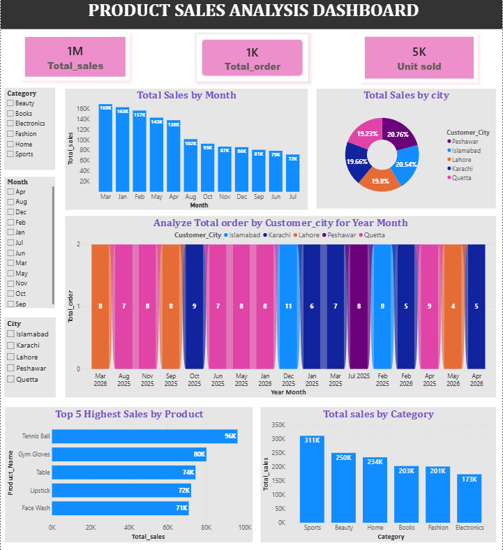

# 📊 Product Sales Analysis Dashboard | Power BI

# 📌 Project Overview

This project is an interactive Product Sales Analysis Dashboard developed using Power BI. The dashboard helps analyze product sales performance and identify meaningful business insights related to sales, orders, product categories, regions, and time periods.

The main objective of this project is to transform raw sales data into an interactive and visually informative dashboard that supports data-driven decision-making.

# 🎯 Project Objectives

Analyze overall sales and profit performance.

Track product and category-wise sales.

Identify top-performing products.

Analyze regional sales performance.

Monitor monthly and yearly sales trends.

Provide interactive insights using filters and slicers.

# 🛠️ Tools & Technologies Used
Power BI

Power Query

DAX

Microsoft Excel

Data Cleaning

Data Transformation

Data Visualization

# 📊 Dashboard Features

The dashboard includes:

Total Sales KPI

Total Orders KPI

Total Quantity Sold

Sales by Product Category

Sales by Region

Monthly Sales Trend

Top Performing Products

Interactive Filters and Slicers

# 🔄 Data Preparation

The raw dataset was cleaned and transformed using Power Query.

Key steps included:

Handling missing and duplicate values.

Checking and correcting data types.

Creating calculated columns where required.

Transforming raw data into an analysis-ready format.

# 📈 Data Analysis

DAX measures were used to calculate important business metrics such as:

Total Sales

Total Orders

Total Quantity Sold

Average Sales

Profit Margin

# 📷 Dashboard Preview

# 💡 Key Insights

Identified top-performing products based on sales and profit.
Compared sales performance across different regions.
Analyzed category-wise contribution to overall revenue.
Observed monthly sales trends and seasonal patterns.
Used interactive slicers to explore data based on different business requirements.
